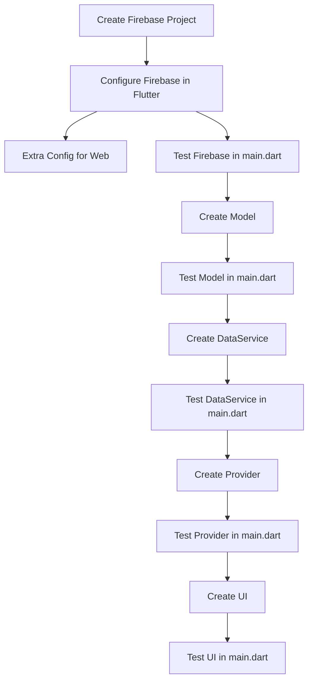

# Firebase CRUD Operations in Flutter

## Overview
This project implements CRUD (Create, Read, Update, Delete) operations in Firebase using Flutter. It utilizes Firestore (NoSQL database) and Firebase Authentication.

## Database Overview
- There are two types of databases: **SQL** and **NoSQL**.
- Firebase Firestore and MongoDB are **NoSQL** databases.
- A **DB bucket** in Firestore stores collections of documents.

## Setting Up Firebase Database
1. Create a Firebase project.
2. Inside the project, create a Firestore database (**Note:** A project and a database are different).
3. Select **Test Mode** for development (**In production, define proper security rules**).

## Project Structure
- **`crudFunctions.dart`**: Contains CRUD operations.
- **`dbFunctions.dart`**: Handles database-related functions.
- **`databaseView.dart`**: UI for displaying Firestore data.

## Firebase Authentication in `main.dart`
```dart
home: StreamBuilder(
  stream: FirebaseAuth.instance.authStateChanges(),
  builder: (context, snapshot) {
    if (snapshot.hasData) {
      return DatabaseView();
    }
    return Signup();
  },
);
```
- `StreamBuilder` listens for changes in authentication state.
- If a user is logged in, `DatabaseView` is displayed; otherwise, `Signup` screen is shown.

## Logout Functionality
```dart
actions: [
  IconButton(
    icon: Icon(Icons.logout),
    onPressed: () async {
      await FirebaseAuth.instance.signOut();
    },
  )
],
```
- Logout button in the AppBar to sign out the user.

## Firebase Setup in `pubspec.yaml`
```yaml
dependencies:
  cloud_firestore: latest_version
  firebase_auth: latest_version
```

## CRUD Operations
### Create
- Implemented `create()` function in `dbFunctions.dart`.
- Firestore stores data in **JSON** format.

### Read
- Created a UI screen for reading data.
- Used `StreamBuilder` to listen to Firestore collection.
- `snapshot` represents documents inside a collection.

### Update
- Implemented update function to modify existing Firestore documents.

### Delete
- Functionality to remove documents from Firestore.

## Debugging
- **RangeError (Stack Overflow)**: Understood and resolved during development.

# Firebase Integration in Flutter

## 🔥 Step-by-Step Flowchart


